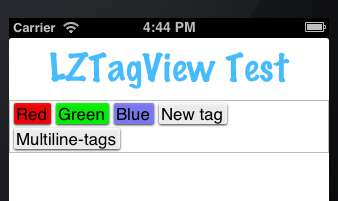

# LZTagView

This is a view-class (and a supporting storage-class) for iOS that displays tags in tag-bubbles.

Tags are conceptually tuples of `NSString` x `UIColor`.

## Features

* The user can tap the area behind the last tag to add a new one.
* He can tap a tag to remove it.
* Suggested tags are displayed in a sticky-view attached to the keyboard. 
* Tapping a suggested tag adds it.
* If the horizontal space is exhausted, a new line is added.

Example project included.

## TODOs

* Add animations
* Make bubbles prettier

(This is part of an app that I am working at now, so I may and probably will change this code soon.)
